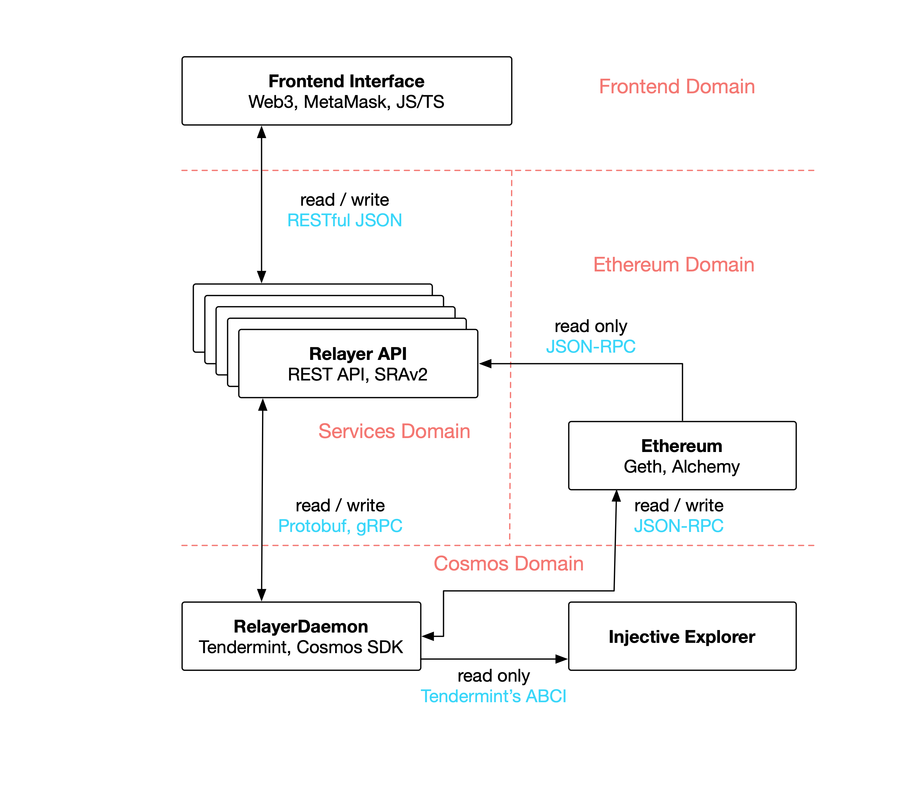

# Injective Protocol Architecture

Injective Protocol is comprised of four principal components: 

1\) Injective Chain

2\) Injective's smart contracts on Ethereum

3) Injective API nodes

4\) Front-end interface

## Injective Chain

The Injective Chain is an fully-decentralized sidechain relayer network which serves as a layer-2 derivatives platform, trade execution coordinator (TEC), and decentralized orderbook. The core consensus is Tendermint-based. 

### Layer-2 Derivatives Platform 

The Injective Chain supports building generalized derivatives/DeFi applications through two avenues: the Injective Futures Protocol and general smart contracts. 

**Injective Futures Protocol**

The Injective Futures Protocol is deployed on the Injective Chain as a Cosmos-SDK based application. This protocol enables traders to create, enter into, and execute decentralized perpetual swap contracts and CFDs on any arbitrary market. 

**Smart Contracts**

The Injective Chain provides a two-way Ethereum peg-zone for Ether and ERC-20 tokens to be transferred to the Injective Chain as well as an EVM-compatible execution environment for DeFi applications. The peg-zone is based off [Peggy](https://github.com/cosmos/peggy) and the EVM execution is based off [Ethermint](https://github.com/chainsafe/ethermint). 

### Trade Execution Coordinator

The Injective Trade Execution Coordinator (TEC) is a decentralized coordinator implementation based off the [0x 3.0 Coordinator](https://github.com/0xProject/0x-protocol-specification/blob/master/v3/coordinator-specification.md) specification. The Injective TEC safeguards trades from front-running and enables lower-latency trading through soft-cancellations. 

### Decentralized Orderbook

Injective's Decentralized Orderbook is a fully decentralized 0x-based orderbook enabling **sidechain order relay with on-chain settlement** - a decentralized implementation of the traditionally centralized [off-chain order relay](https://github.com/0xProject/0x-protocol-specification/blob/master/v2/v2-specification.md#architecture) used by nearly all central limit order book decentralized exchanges. 

Nodes of the Injective Chain host a decentralized, censorship-resistant orderbook which stores and relays orders. 
