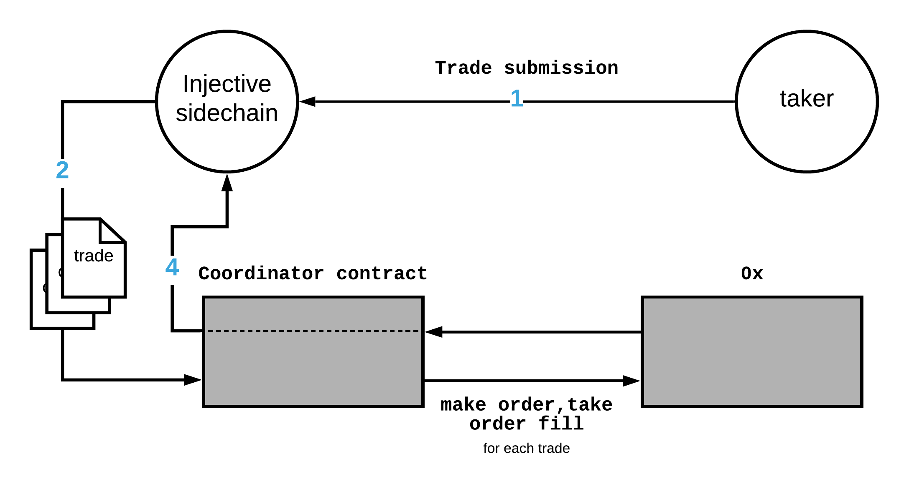

# Injective Contracts

Trades are submitted by the sidechain relay network to Injective's trade execution coordinator smart contract which then executes and settles the trades on 0x.

Injective's coordinator has 2 features that differentiate it from a traditional coordinator. 1. The coodinator is decentralized and the submitting coordinator for each block is randomly chosen by the sidechain application logic. 2. The coodinator submits the coordinated trades on behalf of takers, allowing traders to experience gasless trades.

The flow for filling an order with our coordinator model is as follows:

1. Takers submit valid take orders which result in a trade with negative spread as described in [Take Order Creation](contracts.md#take-order-creation). 
2. At a given block, the chosen coordinator for that block submits the pending queue of trades to the trade execution coordinator smart contract. 
3. The coordinator contract verifies negative spread on each trade and executes the trades on 0x. 
4. The coordinator contract returns [`FillResults[]`](https://github.com/0xProject/0x-protocol-specification/blob/master/v2/v2-specification.md#fillresults). 

